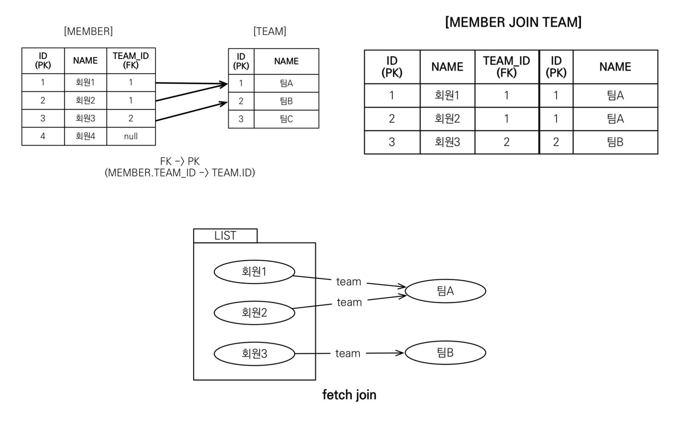

# JPQL

- **Java Persistence Query Language**

- 가장 단순한 조회 방법
  - EntityManager.find()
  - 객체 그래프 탐색(a.getB().getC())

- 테이블이 아닌 **객체를 대상으로 검색하는 객체 지향 쿼리**
- SQL을 추상화해서 특정 데이터베이스 SQL에 의존X
- JPA는 SQL을 추상화한 JPQL이라는 객체 지향 쿼리 언어 제공
- SQL과 문법 유사, SELECT, FROM, WHERE, GROUP BY,HAVING, JOIN 지원

- **JPQL은 엔티티 객체를 대상으로 쿼리**를 질의하고

- **SQL은 데이터베이스 테이블을 대상으로 쿼리**를 질의한다.


### 문법

```text
 SELECT :: =
   SELECT_절
   FROM_절
   [WHERE_절]
   [GROUPBY_절]
   [HAVING_절]
   [ORDERBY_절]

 UPDATE :: = UPDATE_절 WHERE_절
 DELETE :: = DELETE_절 WHERE_절 
```

- ```sql
  SELECT m FROM Member AS m WHERE m.username = 'member1'
  ```

- 엔티티 속성은 대소문자를 구분한다. 
- JPQL의 키워드는 대소문자를 구분하지 않는다.
- 별칭은 필수!! (as는 생략 가능)


### 반환타입

#### 1. TypeQuery

```java
TypedQuery<Member> query = em.createQuery("SELECT m FROM Member m", Member.class);
```

- 반환 타입이 명확할 때 사용
- 두번째 파라미터인 클래스로 반환한다.


#### 2. Query

```java
Query query = em.createQuery("SELECT m.username, m.age FROM Member m");
```

- 반환 타입이 명확하지 않을 때 사용
- 조회결과 컬럼이 하나면 Object, 2개 이상일경우 Object[]


### 결과 조회

​	쿼리 객체에서 아래의 메서드들을 사용해 JPQL을 실행한다.

#### query.getResultList()

- **결과가 하나 이상일 때**, 리스트 반환

- 결과가없으면빈리스트반환

#### query.getSingleResult()

- **결과가 정확히 하나**, 단일 객체 반환
- 결과가 없으면 : javax.persistence.NoResultException
- 둘 이상이면 : javax.persistence.NonUniqueResultException


### 파라미터 바인딩

```java
em.createQuery("SELECT m FROM Member m WHERE m.username = :username", Member.class)
    .setParameter("username", "joont1");
```

- 대부분 메서드 체인 방식으로 사용한다.
- 프로퍼티 앞에 : 을 붙여서 바인딩한다.


### 프로젝션

- **SELECT 절에 조회할 대상을 지정하는것**

- 프로젝션 대상

  - 엔티티

    - `SELECT m FROM Member m `
    - `SELECT m.team FROM Member m `

  - 임베디드 타입

    - `SELECT m.address FROM Member m`

  - 스칼라 타입

    - `SELECT m.username, m.age FROM Member m`

    

#### 여러값 조회

```sql
SELECT m.username, m.age FROM Member m
```

1. Query 타입으로 조회

2. Object[] 타입으로 조회

   ```java
   Query query = em.createQuery("SELECT m.username, m.age, m.team FROM Member m");
   List<Object[]> resultList = query.getResultList();
   ```

3. new 명령어로 조회

   ```java
   TypedQuery<UserDTO> query = em.createQuery("
   	SELECT NEW <패키지 명>.UserDTO(m.username, m.age, m.team)
   	FROM Member m",UserDTO.class
   );
   
   List<UserDTO> resultList = query.getResultList();
   ```

   - 순서와 타입이 일치하는 생성자 필요

   - 단순 값을 DTO로 바로 조회
   - 패키지 명을 포함한 전체 클래스 명 입력


### 페이징 API

- **setFirstResult** : 조회 시작 위치
- **setMaxResults** : 조회할 데이터 수

```java
TypedQuery<Member> query = 
    em.createQuery("SELECT m FROM Member m ORDER BY m.username DESC", Member.class);

query.setFirstResult(10);
query.setMaxResult(20);
query.getResultList();
```


### 조인

- 내부 조인

  ```sql
  SELECT m FROM Member m [INNER] JOIN m.team t
  ```

- 외부 조인

  ```sql
  SELECT m FROM Member m LEFT [OUTER] JOIN m.team t
  ```

- 세타 조인

  ```sql
  select count(m) from Member m, Team t where m.username = t.name
  ```

  

#### ON 절

- 조인 대상 필터링

  ```sql
  SELECT m,t FROM Member m LEFT JOIN m.team to on t.name='A'
  ```

- 연관관계 없는 엔티티 외부 조인

  ```sql
  SELECT m,t FROM Memver m LEFT JOIN Team t on m.username = t.name
  ```


####  경로 표현식

- .(점)을 찍어 객체 그래프를 탐색하는 것

  ```sql
  select m.username -> 상태 필드
  from Member m
    join m.team t -> 단일 값 연관 필드
    join m.orders o -> 컬렉션 값 연관 필드
  where t.name = '팀A'
  ```

  

- **상태 필드(state field)**
  : **단순히 값을 저장**하기 위한 필드
  ex) `m.username`

- **연관 필드(association field)**

  - **단일 값 연관 필드**
    : **대상이 단수의 엔티티(Entity)**
     ex) `@ManyToOne` / `@OneToOne`
  - **컬렉션 값 연관 필드**
    : **대상이 컬렉션(Collection)**
     ex) `@OneToMany` / `@ManyToMany`


#### [특징]

- **상태 필드**(state field): 경로 탐색의 끝, 탐색X
- **단일 값 연관 경로**: 묵시적 내부 조인(inner join) 발생, 탐색O
- **컬렉션 값 연관 경로**: 묵시적 내부 조인 발생, 탐색X
  - FROM 절에서 명시적 조인을 통해 별칭을 얻으면 별칭을 통 해 탐색 가능


- **묵시적 조인**
  : 경로 표현식에 의해 묵시적으로 SQL 조인이 발생되는 것
  (내부조인만 가능 / 외부조인은 불가능)
  
- **명시적 조인**
  : join 키워드를 직접 사용하는 것

  명시적인 조인을 사용하는 것이 좋다!!


### 페치 조인(fetch join)

- JPQL에서 성능 최적화를 위해 제공하는 기능

- 연관된 엔티티나 컬렉션을 SQL 한 번에 함께 조회할 수 있다

  ```sql
  select m from Member m join fetch m.team
  ```

- **`join fetch`** 명령어 사용

- SQL을 한번에 날려 Temp도 함께 SELECT 한다.

  

```java
String jpql = "select m from Member m join fetch m.team"; 
List<Member> members = em.createQuery(jpql, Member.class)
  .getResultList(); 
```


#### [특징]

- 연관된 엔티티들을 SQL 한 번으로 조회 - 성능 최적화
- 엔티티에 직접 적용하는 글로벌 로딩 전략보다 우선함
- 페치 조인은 객체 그래프를 유지할 때 사용하면 효과적


#### DISTINCT

-  SQL의 DISTINCT는 중복된 결과를 제거하는 명령
  -  JPQL에서는 객체 중심이라서 중복 엔티티를 제거해줄 수 없음
- JPQL에서 새롭게 DISTINCT를 제공
  - SQL에 DISTINCT 기능
  - **애플리케이션에서 엔티티 중복 제거**


### 벌크 연산

- JPA 변경 감지 기능으로 실행하려면 너무 많은 SQL을 실행한다

  변경된 데이터가 100개면 100번의 UPDATE SQL을 실행하게된다

- 벌크 연산은 쿼리 한 번으로 여러 테이블 로우 변경을 한다.

- UPDATE, DELETE 지원

- `executeUpdate()` 는 쿼리 작성후 실행 결과는 영향받은 엔티티 수 반환

  ```java
String qlString = "update Product p " +
  									"set p.price = p.price * 1.1 " +
                    "where p.stockAmount < :stockAmount";
  
  int resultCount = em.createQuery(qlString)
                      .setParameter("stockAmount", 10)
                      .executeUpdate();
  ```
  
  
  
  

#### [주의]

- 벌크 연산은 영속성 컨텍스트를 무시하고 데이터베이스에 직접 쿼리
  - 벌크 연산을 먼저 실행
  - 벌크 연산 수행 후 영속성 컨텍스트 초기화