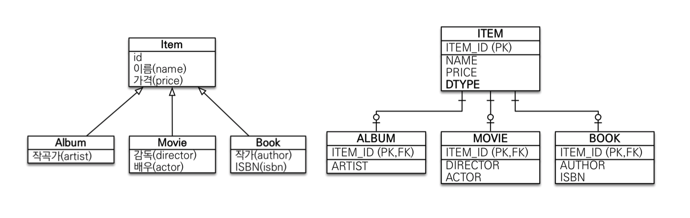
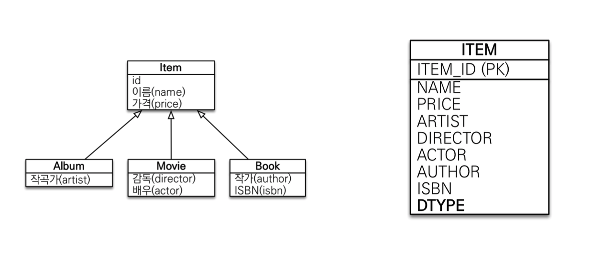
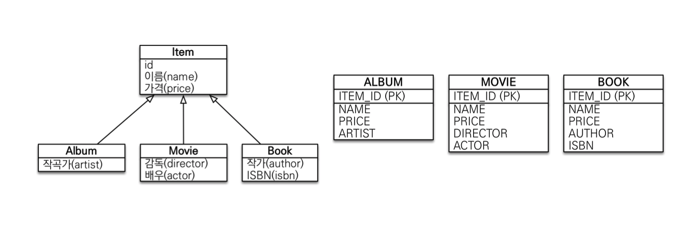
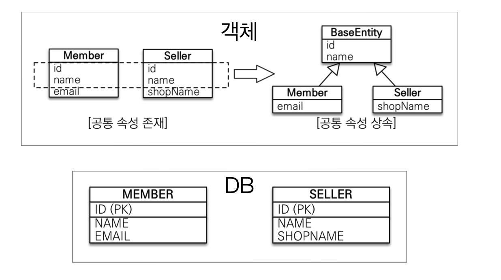

# 고급매핑

## 상속매핑

- 슈퍼타입 서브타입 논리 모델을 실제 물리 모델로 구현하는 방법

- 어노테이션
  - `@Inheritance(strategy=InheritanceType.XXX)`
    - `JOINED` : 조인전략
    - `SINGLE_TABLE` : 단일 테이블 전략
    - `TABLE_PER_CLASS` : 구현 클래스마다 테이블 전략
  - `@DiscriminatorColumn(name=“DTYPE”)`
  - `@DiscriminatorValue(“XXX”)`

### 1. 조인 전략

- 장점
  - 테이블 정규화
  - 외래 키 참조 무결성 제약조건 활용가능
  - 저장공간 효율화
- 단점
  - 조회시 조인을 많이 사용, 성능 저하
  - 조회 쿼리가 복작함
  - 데이터 저장시 INSERT SQL 2번 호출

### 2. 단일 테이블 전략

- 장점
  - 조인이 필요 없으므로 일반적으로 조회 성능이 빠름
  - 조회 쿼리가 단순함
- 단점
  - 자식 엔티티가 매핑한 칼럼은 모두 null 허용
  - 단일 테이블에 모든 것을 저장하므로 테이블이 커질 수 있다.
  - 상황에 따라서 조회 성능이 오히려 느려질 수 있다.

### 3. 구현 클래스마다 테이블 전략

- 이 전략은 DBA와 ORM 전문가 둘 다 추천 X
- 장점
  - 서브 타입을 명확하게 구분해서 처리할 때 효과적
  - not null 제약조건 사용 가능
- 단점
  - 여러 자식 테이블을 함께 조회할 때 성능이 느림 (UNION SQL 필요)
  - 자식 테이블을 통합해서 쿼리하기 어려움

## @MappedSuperclass

- 공통 매핑 정보가 필요할 때 사용

- 직접 생성해서 사용할 일이 없으므로 **추상 클래스 권장**
- 부모 클래스를 상속 받는 **자식 클래스에 매핑 정보만 제공**
- 테이블과 관계 없고, 단순히 엔티티가 공통으로 사용하는 매핑 정보를 모으는 역할
- 주로 등록일, 수정일, 등록자, 등과 같은 전체 엔티티에서 공통으로 적용하는 정보를 모을 때 사용
- `@Entity`클래스는 엔티티나 `@MappedSuperclass`로 지정한 클래스만 상속 가능