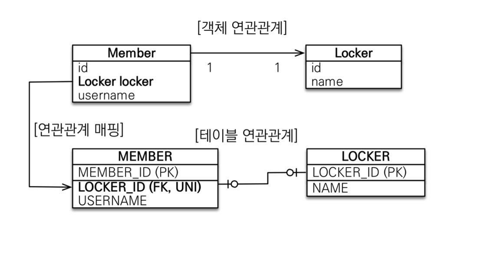

# 연관관계 매핑

**객체를 테이블에 맞추어 데이터 중심으로 모델링하면, 협력 관계를 만들 수 없습니다.**

- **테이블은 외래 키로 조인**을 사용해서 연관된 테이블을 찾습니다.
- **객체 참조**를 사용해서 연관된 객체를 찾습니다.
- 테이블과 객체 사이에는 이런 큰 간격이 있습니다.


## 단방향 연관관계


```java
@Entity
public class Member {

  @Id @GeneratedValue
  private Long id;
  
  @Column(name = "USERNAME")
  private String name;
  private int age;
  
  @ManyToOne
  @JoinColumn(name = "TEAM_ID")
  private Team team;
  
}
```

- 다음과 같이 `@ManyToOne`, `@JoinColumn`으로 객체의 참조와 테이블의 외래 키를 매핑하였다.


## 양방향 연관관계

```java
@Entity
public class Team {
  
  @Id @GeneratedValue
  private Long id;
  
  private String name;

  @OneToMany(mappedBy = "team")
  List<Member> members = new ArrayList<Member>();
}
```


- 객체의 **양방향 관계는 사실 양방향 관계가 아니라 서로 다른 단 뱡향 관계 2개**다
- 객체를 양방향으로 참조하려면 **단방향 연관관계를 2개** 만들어 야 한다.


### 연관관계의 주인 (Owner)

- 객체의 두 관계중 하나를 연관관계의 주인으로 지정
- 연관관계의 주인만이 외래 키를 관리(등록, 수정)
- 주인이 아닌쪽은 읽기만 가능
- 주인은 mappedBy 속성 사용 X
- 주인이 아니면 mappedBy 속성으로 주인 지정


### [주의]

- 순수 객체 상태를 고려해서 항상 양쪽에 값을 설정하자
- 연관 관계 편의 메소드를 생성하자
- 양방향 매핑시에 무한 루프를 조심하자


## 다양한 연관관계 매핑

- 연관관계 매핑시 고려사항 3가지
  - 다중성
  - 단방향, 양방향
  - 연관관계의 주인


### 1. 다대일 @ManyToOne

| 속성         | 기능                                                         | 기본값                                                |
| ------------ | ------------------------------------------------------------ | ----------------------------------------------------- |
| optional     | false로 설정하면 연관된 엔티티가 항상 있어야 한다            | true                                                  |
| fetch        | 글로벌 패치 전략을 설정한다. (자세한 내용은 추후에)          | @ManyToOne=FetchType.EAGER, @OneToMany=FetchType.LAZY |
| cascade      | 영속성 전이 기능을 사용한다.(자세한 내용은 추후에)           |                                                       |
| targetEntity | 연관된 엔티티의 타입 정보를 설정한다. 이 기능은 거의 사용하지 않음 |                                                       |

- 가장 많이 사용하는 연관관계
- 외래 키가 있는 쪽이 연관관계의 주인
- 양쪽을 서로 참조하도록 개발


### 2. 일대다 @OneToMany

| 속성         | 설명                                                         | 기본값                                                |
| ------------ | ------------------------------------------------------------ | ----------------------------------------------------- |
| mappedBy     | 연관관계의 주인 필드를 선택한다.                             |                                                       |
| fetch        | 글로벌 패치 전략을 설정한다                                  | @ManyToOne=FetchType.EAGER, @OneToMany=FetchType.LAZY |
| cascade      | 영속성 전이 기능을 사용한다.                                 |                                                       |
| targetEntity | 연관된 엔티티의 타입 정보를 설정한다. 이 기능은 거의 사용하지 않는다. 컬렉션을 사용해도 제네릭으로 타입 정보를 알 수 있다. |                                                       |

- 일대다 단방향은 일대다에서 **일(1)이 연관관계의 주인**
- 테이블 일대다 관계는 항상 **다(N) 쪽에 외래 키가 있음**
- `@JoinColumn`을 꼭 사용해야 함. 그렇지 않으면 조인 테이블 방식을 사용함(중간에 테이블을 하나 추가함)
- 객체와 테이블의 차이 때문에 반대편 테이블의 외래 키를 관리하는 특이한 구조
- **단점**
  - 엔티티가 관리하는 외래 키가 다른 테이블에 있음
  - 연관관계 관리를 위해 추가로 UPDATE SQL 실행
- 일대다 단방향 매핑보다는 **다대일 양방향 매핑을 사용**하자


### 3. 일대일 관계 @OneToOne

- 주 테이블이나 대상 테이블 중에 외래 키 선택 가능
- 외래 키에 데이터베이스 유니크 제약조건 추가
- 다대일 양방향 매핑 처럼 외래 키가 있는 곳이 연관관계의 주인
- 반대편은 mappedBy 적용



- **주테이블에외래키**
- 주 객체가 대상 객체의 참조를 가지는 것 처럼 주 테이블에 외래 키를 두고 대상 테이블을 찾음
  - 객체지향 개발자 선호  JPA 매핑 편리
- 장점: 주 테이블만 조회해도 대상 테이블에 데이터가 있는지 확인 가능
  - 단점: 값이 없으면 외래 키에 null 허용 
- **대상테이블에외래키**
- 대상 테이블에 외래 키가 존재
  - 전통적인 데이터베이스 개발자 선호
- 장점: 주 테이블과 대상 테이블을 일대일에서 일대다 관계로 변경할 때 테이블 구조 유지
  - 단점: 프록시 기능의 한계로 **지연 로딩으로 설정해도 항상 즉시 로딩됨**(프록시는 뒤에서 설명)


### @JoinColumn

| 속성                                                         | 기능                                                         | 기본값                                              |
| ------------------------------------------------------------ | ------------------------------------------------------------ | --------------------------------------------------- |
| name                                                         | 매핑할 외래 키 이름                                          | "필드명" + "_" + "참조하는 테이블의 기본 키 컬럼명" |
| referencedColumnName                                         | 외래 키가 참조하는 대상 테이블의 컬럼명                      | 참조하는 테이블의 기본 키 컬럼명                    |
| foreignKey(DDL)                                              | 외래 키 제약조건을 직접 지정할 수 있다. 이 속성은 테이블을 생성할 때만 사용한다. |                                                     |
| unique<br>nullable<br>insertable<br>updatable<br>columnDefinition<br>table | @Column의 속성과 같다                                        |                                                     |