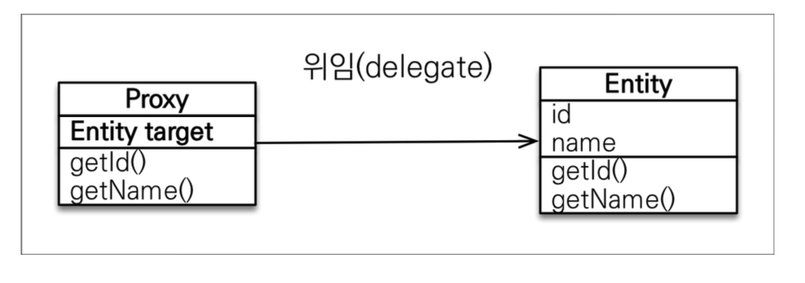
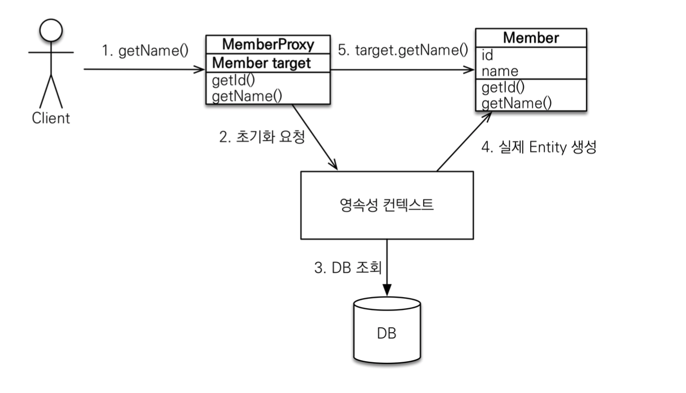
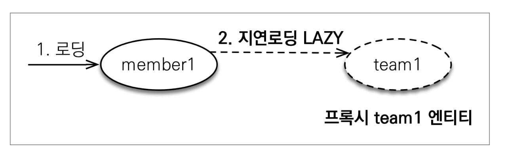

# 프록시

- JPA 구현체들은 연관된 객체들 처음부터 데이터베이스에서 조회하는 것이 아니라,

  실제 사용하는 시점에 데이터베이스에서 조회할 수 있다. 이와 관련 된 기술이 **프록시** 인데,

  이 프록시를 통해서 **즉시로딩 ( EAGER ) 과 지연로딩 ( LAZY )** 을 할 수 있다.

- `em.find()` : DB를 통해서 실제 엔티티 객체 조회
- `em.getReference()` : **DB 조회를 미루는 가짜(프록시) 엔티티 객체 조회**


### 프록시 특징

- 실제 클래스를 상속 받아서 만들어짐

- 실제 클래스와 겉 모양이 같다.

- 프록시 객체는 실제 객체의 참조(target)를 보관

- 프록시 객체를 호출하면 프록시 객체는 실제 객체의 메소드 호출

- 프록시 객체를 초기화 할 때, 프록시 객체가 실제 엔티티로 바뀌는 것은 아님,

  초기화되면 프록시 객체를 통해서 실제 엔티티에 접근 가능



```java
Member member = em.getReference(Member.class, "id1");
member.getName();
```




1. em.getReference()로 프록시 객체를 가져온 다음에, **getName() 메서드를 호출** 하면
2. MemberProxy 객체에 처음에 target 값이 존재하지 않는다. JPA가 영속성 컨텍스트에 초기화 요청을 한다.
3. 영속성 컨텍스트가 DB에서 조회한다.
4. DB에서 실제 Entity를 생성해준다.
5. 프록시 객체가 가지고 있는 target의 getName()을 호출해서 결국 member.getName()을 호출한 결과를 받을 수 있다.


### 지연로딩

- `@ManyToOne(fetch = FetchType.LAZY)` 다음과 같이 **FetchType.LAZY** 으로 설정한다.

```java
@Entity
public class Member {
  
  @Id
  private Long id;
  
  @ManyToOne(fetch = FetchType.LAZY)
  @JoinColumn(name = "TEAM_ID")
  private Team team;

}
```

- Member객체를 조회하면 Team객체의 클래스는 프록시 객체가 조회된다.
- Team의 정보를 호출하면 필요한 시점에 쿼리가 나가 Team을 조회한다.




### 즉시로딩

- `@ManyToOne(fetch = FetchType.EAGER)` 다음과 같이 **FetchType.EAGER** 으로 설정한다.

```java
@Entity
public class Member {
  
  @Id
  private Long id;
  
  @ManyToOne(fetch = FetchType.EAGER)
  @JoinColumn(name = "TEAM_ID")
  private Team team;

}
```

- member조회시 team정보도 같이 조회한다.
- 이때 team객체는 프록시가 아니라 실제 객체이다.


### 프록시와  즉시로딩 주의

- **가급적 지연 로딩만 사용한다**
- 즉시 로딩을 적용하면 예상하지 못한 SQL이 발생한다.
- 즉시 로딩은 JPQL에서 N+1 문제를 일으킨다.
  - ex) 한개의 쿼리를 날렸는데 추가로 N개의 쿼리가 나가서 N+1이라 부른다.
- @ManyToOne, @OneToOne은 즉시 로딩이 기본값
- @OneToMany, @ManyToMany는 지연 로딩이 기본값